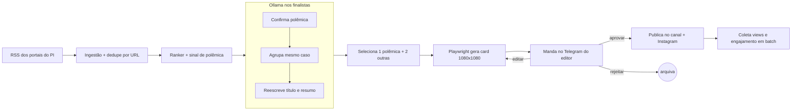
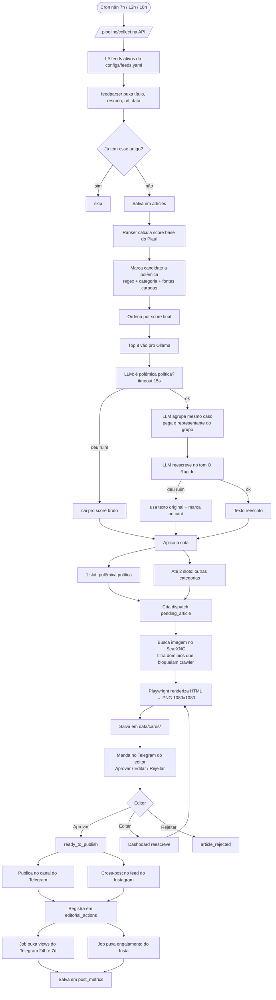
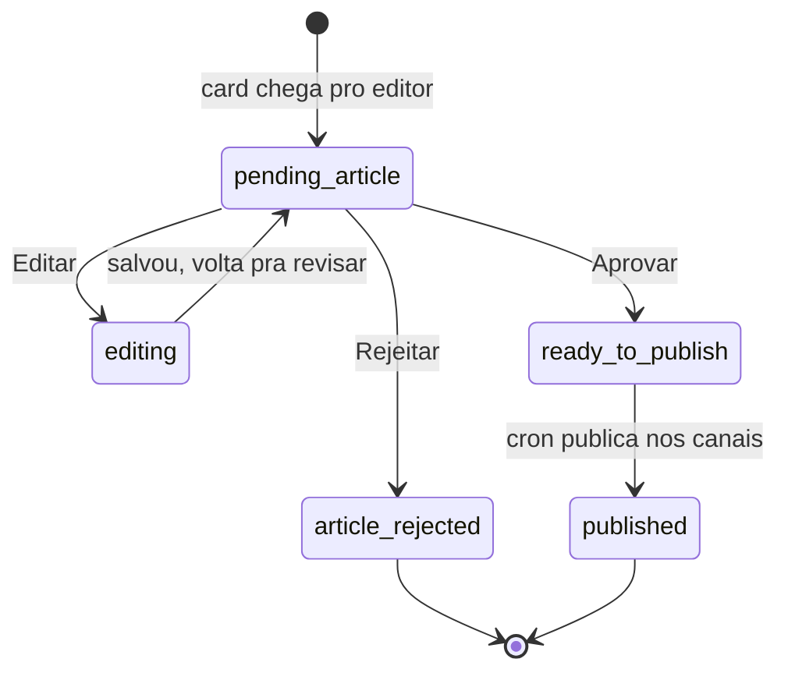

# Pipeline do O Rugido

Portal de notícias do Piauí com foco em polêmica política. Três edições por dia (7h, 12h, 18h), sete dias por semana. Cada edição tenta ter uma polêmica política e mais até duas notícias de outras áreas. Se o dia tá calmo, publica menos.

## Fluxo em uma tela



## Passo a passo detalhado



## O que o editor vê no Telegram



## Regras que definimos

| O quê | Como fica |
|---|---|
| Público | Piauiense comum, celular na mão, tempo curto |
| Diferencial | Polêmica política do PI (mas cobre resto também) |
| Cadência | 3 edições/dia (7h, 12h, 18h) todo dia |
| Cota por edição | 1 polêmica política + até 2 outras |
| Dia sem polêmica | Publica menos. Não força volume. |
| Tom | Direto, sem rodeio, sem sarcasmo, sem opinião |
| Reescrita | Ollama mexe em título + resumo antes do editor ver |
| Timeout LLM | 15s. Se estourar, publica com o texto do feed original |
| Dedupe entre fontes | LLM agrupa "mesmo caso" nos finalistas |
| Editor | Fila humana no Telegram, aprova/edita/rejeita |
| Auditoria | editorial_actions guarda quem aprovou e quando |
| Onde publica | Canal do Telegram + feed do Instagram (cross-post) |
| Formato do card | 1080x1080. Insta feed corta, aceita por ora. |
| Sucesso = | Views no Telegram + engajamento no Insta |

## Sobre a detecção de polêmica

Duas camadas: primeiro uma regra barata (regex de palavras tipo "operação", "denúncia", "indiciado", "MP", "PF", "corrupção", "escândalo" + categoria política + lista de fontes que cobrem esse tipo), depois o Ollama confirmando nos ~8 finalistas. A regra barata evita rodar LLM em 50 artigos por coleta.

## Exportar pra apresentação

Abre no GitHub que ele renderiza direto. Se precisar PNG em alta pra colar em slide, copia o bloco ```mermaid...``` e joga em https://mermaid.live/ — tem botão de Export lá.
